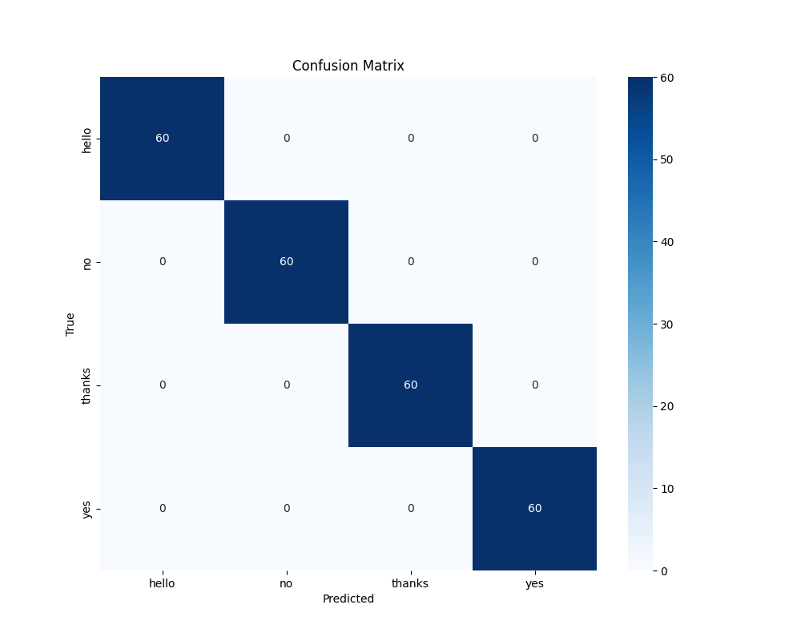
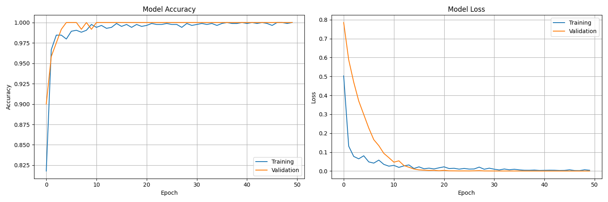

# Sign Language Detection System using Machine Learning

A real-time system that detects and interprets sign language gestures using webcam input, MediaPipe hand tracking, and a deep learning classifier.

---

## Features
- **Real-Time Landmark Detection**: Tracks up to 2 hands and extracts 21 3D coordinates per hand using Google MediaPipe.
- **Single and Two-Handed Gesture Support**: Zero-pads single-hand gestures to fit a unified 126-dimension feature space for robust two-handed recognition.
- **Translation & Scale Invariance**: Normalizes coordinates relative to the palm center and wrist-to-middle-finger length, ensuring gestures are recognized regardless of hand size or position.
- **Premium HUD Overlay**: Styled OpenCV display window featuring joints visualization, rolling average FPS counter, gesture legend, active status tracking, and a live confidence bar.

---

## Project Structure

```
sign_language_ml/
├── data/                  # Data storage
│   ├── raw/               # Raw gesture data (JSON landmark files)
│   └── processed/         # Processed datasets (Numpy NPZ format)
├── models/                # Trained models, metadata, and performance graphs
├── src/                   # Source code
│   ├── camera_test.py     # Webcam diagnostic tool
│   ├── data_collection.py # Landmark recorder module
│   ├── data_preprocessing.py # Landmark normalization and augmentation module
│   ├── model_training.py  # Dense/LSTM model training module
│   ├── realtime_recognition.py # Real-time webcam inference HUD
│   └── main.py            # Unified command-line interface entry point
├── generate_dummy_data.py # Utility script to generate synthetic test data
└── requirements.txt       # Python dependencies
```

---

## Setup & Installation

1. **Activate Virtual Environment** (Create one if needed):
   ```bash
   python -m venv venv
   # Windows:
   .\venv\Scripts\activate
   # macOS/Linux:
   source venv/bin/activate
   ```

2. **Install Dependencies**:
   ```bash
   pip install -r requirements.txt
   ```

3. **Verify Webcam Access**:
   ```bash
   python src/camera_test.py
   ```

---

## Pipeline & Workflow

### 1. Collect Gesture Data
Record coordinates for custom gestures (e.g., `hello`, `thanks`, `yes`, `no`):
```bash
python src/main.py collect --gestures hello thanks yes no --samples 50 --output data/raw
```
*Tip: Place your hand in position and hold **SPACE** to record. Tilt and move your hand slightly for better variations.*

### 2. Preprocess & Augment
Clean and normalize coordinates. Applies random rotation, translation, and scale transformations:
```bash
python src/main.py preprocess --input data/raw --output data/processed --augment
```

### 3. Train Model
Train a Feedforward Dense Neural Network:
```bash
python src/main.py train --data data/processed --output models --epochs 50
```

### 4. Run Live Recognition
Run real-time inference using the premium HUD visualization:
```bash
python src/main.py recognize --threshold 0.7
```
- **`q`**: Quit the live feed.
- **`c`**: Clear the detected gesture sequence box.
- **`s`**: Take a screenshot (saved as `screenshot_YYYYMMDD_HHMMSS.png`).

---

## Model Performance

The training process and final test set classification results are illustrated below:

### 1. Confusion Matrix


*Explanation*: The confusion matrix shows model performance on the test dataset split. The dense neural network achieves a **100% correct classification rate** across the custom gesture classes (`hello`, `no`, `thanks`, `yes`). The clean diagonal structure confirms that normalized joint offsets are highly separable features.

### 2. Training History


*Explanation*: The training history plot tracks validation accuracy and categorical cross-entropy loss:
- **Model Accuracy**: Validation accuracy climbs rapidly to 1.0 (100% accuracy) within the first 15 epochs and remains stable.
- **Model Loss**: Training and validation losses decay smoothly and converge toward zero, proving that regularization techniques (Batch Normalization and Dropout) effectively prevented overfitting.

---

## Technical Details

### Data Normalization
To make gesture recognition robust to distance and position:
- **Translation**: Centers the coordinate system on the palm center (calculated as the average of the wrist and middle finger MCP joint).
- **Scaling**: Divides all coordinate offsets by the distance between the wrist and the middle finger MCP joint.

### Model Architecture (Dense)
- **Input Layer**: 126 nodes (matching flattened 3D landmarks for 2 hands).
- **Hidden Layer 1**: 128 nodes with ReLU activation, Batch Normalization, and 30% Dropout.
- **Hidden Layer 2**: 64 nodes with ReLU activation, Batch Normalization, and 30% Dropout.
- **Output Layer**: Softmax activation mapping to the number of target gestures.

---

## Troubleshooting

- **Camera Fails to Open**:
  - Verify that another application (like Zoom or Teams) is not locking the webcam.
  - Run `python src/main.py recognize --camera 1` to try an alternative camera index.
- **Model Directory Error**:
  - The scripts automatically auto-detect folders. Ensure commands are run from the project root directory.
